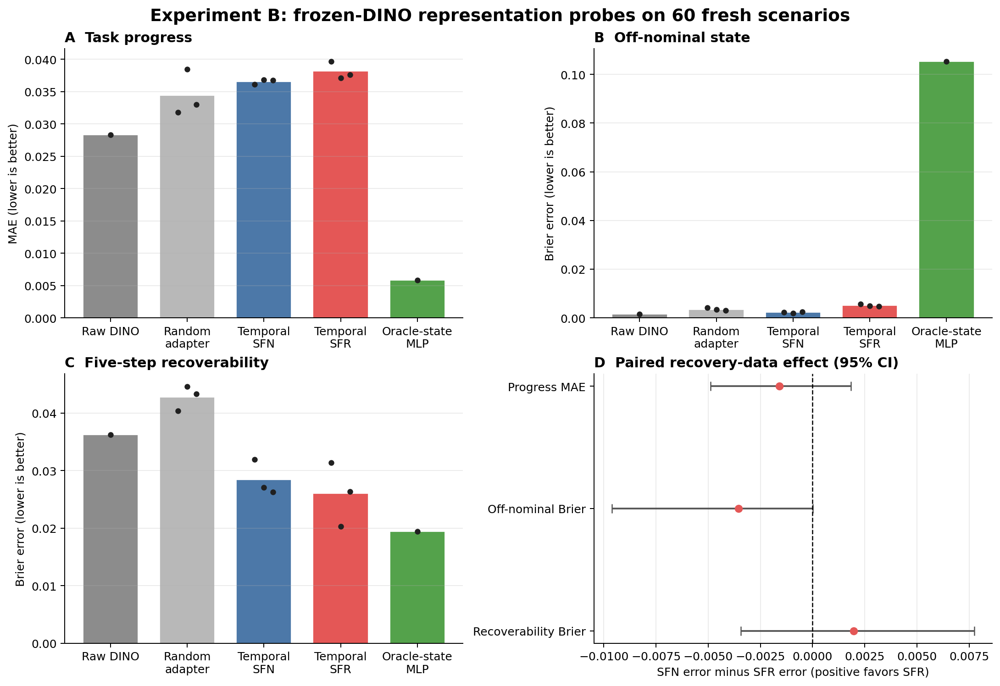

# Experiment B：视觉恢复表征小规模实验报告

## 1. 结论摘要

本实验在冻结 DINOv2 视觉编码器的前提下，比较了由成功数量匹配数据 `SFN` 与 recovery-rich 数据 `SFR` 训练的 action-conditioned temporal representation。三组训练 seed 均在同一组 60 个全新 PushT 场景上评价。

**严格结论：Experiment B 的 Gate C 未通过。** `SFR` 相对 `SFN` 只在 5-step recoverability 的平均 Brier error 上有很小改善，但跨 seed × scenario 的 95% 置信区间跨过 0；task progress 与 off-nominal 指标没有改善。原始 frozen DINO 在当前受控 translation 场景中已经接近饱和，因此现有结果不支持“recovery-rich data 改善了视觉表征”的研究结论。

这不否定 Experiment A：oracle-state 实验已经证明 recovery data 改善 recovery dynamics prediction、action ranking 和 fresh-test closed-loop success。它说明的是：在当前小规模、视觉上较容易的 PushT 设置中，这个动力学优势还没有转化成可由三个冻结 probe 稳健测出的视觉表征优势。



图中 A–C 的柱为指标均值，黑点为单个训练 seed；raw DINO 与 oracle-state 只运行一次固定基线。D 中正值代表 `SFR` 的误差低于 `SFN`，三项 95% CI 均穿过 0。

## 2. 研究问题与受控比较

Experiment B 问的是：只向模型提供 RGB、agent proprioception 和动作历史时，recovery-rich trajectories 是否能让相同容量的时序模型形成更有利于恢复判断的 contextual predictive representation？

主比较严格固定预算和成功轨迹数：

| 配置 | 训练分支 | 第三条 continuation 的性质 | 作用 |
|---|---|---|---|
| `D_SFN_balanced` | `S + F1 + N` | `N` 是扰动前 nominal manifold 上的成功 continuation | 成功数量匹配的 control |
| `D_SFR_balanced` | `S + F1 + R` | `R` 从扰动后的相同 branch state 执行 reposition、recontact 和 corrective push | recovery-rich treatment |

两者的场景、轨迹数、成功轨迹数、branch horizon、模型参数量、训练 epoch、优化器、normalization 和 seeds 全部相同。唯一关键差别是 `N` 被 `R` 替换，因此可区分“更多成功样本”与“recovery-specific states/actions”。失败动作 `F1` 在两组中完全相同；模型学习的是给定状态和动作后的结果，不是模仿 `F1`。

## 3. 与原始 DINO-WM 框架的边界

原始框架提供 frozen DINO visual features 与 causal ViT predictor 的核心思路。本项目为 Experiment B 新增的是：

```text
saved simulator state
  -> deterministic RGB rerender
  -> frozen DINOv2 ViT-S/14 patch tokens
  -> trainable action-conditioned temporal adapter
  -> contextual predictive representation
  -> frozen ridge/logistic probes
```

新增实现包括 `phase3/data.py`、`models/visual_temporal_model.py`、`cache_pusht_dino.py`、`train_visual_wm.py`、`evaluate_visual_probes.py`、`aggregate_visual_probes.py`、对应 SLURM 脚本与 Phase 3 tests。原始 `models/dino.py` 和 `models/visual_world_model.py` 没有被当作本实验的新贡献；Experiment A 的 `StateWorldModel` 也没有参与视觉模型输入。

## 4. 数据与视觉缓存

### 4.1 数据划分

| 用途 | 数据 | 场景数 | 是否用于调参 |
|---|---|---:|---|
| probe/model train | `pusht_recovery_phase1_pilot_v2` train split | 140 | 是 |
| checkpoint/probe selection | 同一 v2 数据的 validation split | 30 | 是 |
| 独立确认 | `pusht_recovery_confirmatory_v2_seed20260916_60` all-test | 60 | 否 |

scenario/pair 在窗口生成前完成划分；同一 pair 的 `S/N/F1/F2/R` 不会跨 split。fresh 60 个场景是 Experiment A 锁定 P3 后生成的独立测试集，Experiment B 未在其上选择模型、probe 正则项或标签阈值。

### 4.2 图像与 DINO 特征

- 从每一帧保存的 27 维完整 simulator state 确定性重渲染 `224 × 224` RGB，避免旧视频与 fresh no-video 数据产生域差异。
- 使用冻结的 `dinov2_vits14`，代码 revision 为 `b48308a394a04ccb9c4dd3a1f0a4daa1ce0579b8`。
- 原始 `16 × 16 = 256` 个、每个 384 维的 patch tokens 自适应池化为 `4 × 4 = 16` 个 token，以控制 pilot 计算量；缓存为 float16。
- v2 cache 共 39,000 帧、约 479 MB；确定性 RGB replay 最大像素误差为 0，token 全部有限，最大绝对值 19.234375。
- fresh test cache 共 11,700 帧、约 144 MB，也通过相同审计。

## 5. 模型与训练设置

### 5.1 Temporal visual world model

| 项目 | 设置 |
|---|---|
| 输入 | 16 个 frozen DINO tokens + 4 维 proprioception + 2 维 action |
| history / training window | 3 个 actions、4 帧 teacher-forced observation |
| causal predictor | 4 层、4 heads、model dim 128、MLP dim 256、dropout 0.1 |
| 参数量 | 754,436（DINO encoder 不训练、不计入） |
| 预测目标 | 下一帧 DINO token residual + 下一帧 proprioception residual |
| loss | one-step loss + 0.25 × autoregressive rollout loss；proprio loss 权重 0.25 |
| optimizer | AdamW，learning rate `3e-4`，weight decay `1e-4` |
| 训练 | 20 epochs，batch size 128，seeds 0/1/2 |
| model selection | 各配置、各 seed 只按 v2 validation total loss 选择 best checkpoint |

SFN 的 train/validation windows 为 15,960/3,420；SFR 具有相同窗口预算。所有模型共用只由 `D_SF` train split 计算的 proprioception statistics。SFN 与 SFR 的 validation loss 因目标状态分布不同，不能直接横向解释为模型优劣。

contextual representation 为最后时刻 causal visual tokens 的均值与 proprio token 的拼接，共 256 维。probe 训练时 world model 完全冻结。

### 5.2 五个对照层级

| 表示 | 含义 | Probe family |
|---|---|---|
| Raw DINO | 当前帧 mean-pooled frozen DINO + proprio + action history | linear |
| Random adapter | 未训练但同架构的 temporal adapter | linear |
| Temporal SFN | 用 `D_SFN_balanced` 训练的 adapter | linear |
| Temporal SFR | 用 `D_SFR_balanced` 训练的 adapter | linear |
| Oracle-state reference | 11 维完整 oracle state，不作为视觉输入 | 固定 64 hidden-unit shallow MLP |

视觉表示全部使用同容量 ridge/logistic probe，正则项只在 v2 validation 上选择。oracle state 与 coverage 的几何关系是非线性的，因此另用预先固定容量的 shallow MLP 作为信息上界参考；它不是视觉模型，也不参与 SFN/SFR 主检验。

## 6. Probe 定义与指标含义

### 6.1 Task progress regression

标签是 simulator 计算的物体与目标几何 coverage，范围约为 0–1。

- **MAE**：预测 coverage 与真实 coverage 的平均绝对误差，越低越好。
- **R²**：解释目标方差的比例，1 为完美预测；0 相当于只预测均值。
- **Spearman**：预测与真实 progress 的排序相关性，越接近 1 越好。

### 6.2 Off-nominal classification

正样本只取 `R` 的 `reposition/recontact` 帧；负样本取同一 scenario、同一 branch-relative frame 的 `N`。`F1/F2/S` 和 `R` 的 corrective-push/hold 均排除，使比较严格对齐且类别比例为 50/50。

- **Balanced accuracy**：分别计算正负类召回率再平均，0.5 近似随机，越高越好。
- **AUROC**：不同阈值下区分正负类的排序能力，0.5 近似随机，1 为完美。
- **Average precision (AP)**：precision-recall 曲线的汇总，类别不平衡时尤其有用，越高越好。
- **Brier error**：预测概率与 0/1 标签之差的平方均值，同时衡量准确性和概率校准，越低越好。

### 6.3 Five-step recoverability

只评价尚未成功的 `S/N/R` 帧。若数据中记录的 oracle continuation 能在之后 5 步内成功，则标记 recoverable；正样本比例为 58.49%。该标签是固定 controller、固定 action bound、固定 horizon 下的操作性定义，不代表无限时间的理论可恢复性。

## 7. 实验结果

### 7.1 Fresh-test 绝对指标

| 表示 | Progress MAE ↓ | Progress R² ↑ | Off-nominal AUROC ↑ | Off-nominal Brier ↓ | Recoverability AUROC ↑ | Recoverability Brier ↓ |
|---|---:|---:|---:|---:|---:|---:|
| Raw DINO | 0.02828 | 0.98641 | 1.00000 | **0.00162** | 0.98801 | 0.03624 |
| Random adapter（3-seed mean） | 0.03443 | 0.97915 | 0.99982 | 0.00350 | 0.98555 | 0.04276 |
| Temporal SFN（3-seed mean） | 0.03654 | 0.97661 | **1.00000** | 0.00222 | 0.99283 | 0.02843 |
| Temporal SFR（3-seed mean） | 0.03814 | 0.97493 | 0.99809 | 0.00510 | **0.99311** | 0.02602 |
| Oracle-state MLP reference | **0.00581** | **0.99915** | 0.99972 | 0.10534 | 0.99424 | **0.01941** |

oracle off-nominal 的 AUROC 很高但 Brier 较差，说明该固定 MLP 的概率校准不好；因此不能把每一个 oracle 数字机械地理解成数学上界。它在 progress 与 recoverability 两个关键任务上提供了合理的状态信息参考。

主要观察：

1. raw DINO 已能近乎完美地读取 coverage 和当前 recovery-prefix 偏离，说明当前画面中的物体位置、目标位置和 agent 位置非常显式。
2. temporal training 相对 raw/random 明显改善 recoverability：SFN/SFR Brier 为 0.02843/0.02602，而 raw/random 为 0.03624/0.04276。这说明时序预测训练本身有价值。
3. 但 recovery-specific 的关键比较是 SFR 与成功数量匹配的 SFN，而不是 SFR 与 random。该差异很小且不稳定。
4. temporal representation 的 progress MAE 反而高于 raw DINO，说明当前 256 维 contextual bottleneck 丢失了一部分静态几何精度。

### 7.2 SFN–SFR 配对效应

每个 fresh scenario 先计算 `SFN error − SFR error`，再对训练 seed 与 scenario 做 20,000 次 crossed bootstrap。正值才表示 SFR 更好。

| Probe | 平均误差降低（正值利于 SFR） | 95% CI | 单 seed 均值 | 判断 |
|---|---:|---:|---|---|
| Progress MAE | -0.001595 | [-0.004886, 0.001846] | -0.003561 / -0.000321 / -0.000904 | SFR 未改善，三个 seed 均为负 |
| Off-nominal Brier | -0.003544 | [-0.009608, 0.000018] | -0.003762 / -0.003754 / -0.003115 | SFR 持续较差 |
| Recoverability Brier | +0.001973 | [-0.003433, 0.007737] | +0.000660 / +0.005642 / -0.000382 | 小且 seed-dependent，CI 跨 0 |

三项检验都没有形成排除 0 的正向置信区间。因此不能把 recoverability 均值的轻微上升写成可靠的 recovery-specific representation effect。

## 8. Gate C 与为何不继续 visual closed-loop

Gate C 预先要求：learned temporal representation 必须在 scenario-disjoint test 上相对 raw DINO 和 random adapter 形成可信改善，才允许作视觉表征结论。当前只有“temporal training 对 recoverability 有帮助”，没有“用 R 替代 N 带来稳定额外帮助”，且 progress/off-nominal 不满足要求，所以 **Gate C = fail**。

本轮没有继续实现或调试 goal-set visual CEM，也没有在这 60 个 fresh scenarios 上开展 visual closed-loop planner tuning，原因是：

- 当前 probe 已缺少 recovery-specific 信号，闭环差异难以归因于视觉表征；
- 这组 fresh test 已用于最终 probe 报告，不应再被转化为 planner validation set；
- 继续在 test 上挑目标距离、CEM horizon 或 hold 规则会制造新的调参泄漏。

因此这是一个按决策门结束的完整 feasibility test，而不是代码中断。若未来在 validation-only 的更强任务上得到表示信号，需锁定 visual planner 后再生成另一批 fresh confirmatory pairs。

## 9. 局限与改进方向

1. **任务过于视觉显式。** 受控 translation 中目标和 T 形物体无遮挡、背景固定，raw DINO 已饱和。下一轮应优先使用 held-out severity/type、目标位置变化、遮挡或外观随机化，而不是简单增加同分布场景数。
2. **Off-nominal 标签仍太容易。** reposition/recontact 的 agent 位置与 nominal N 差异很大。可改为只比较重接触附近的 hard negatives，或预测连续的 nominal-manifold distance。
3. **Recoverability horizon 太短。** 5-step 标签主要反映“离成功很近”。可预注册 5/10/20-step 多尺度 time-to-recovery，并按 perturbation cell 分层。
4. **表示池化可能过强。** 16 个 patch tokens 最终均值到一个 visual vector，可能丢失接触几何。可冻结当前结果，另在 validation 上比较 spatial-token probe、attention pooling 或 recovery-prefix contrastive objective。
5. **预测 loss 未直接优化 recovery discrimination。** 可以增加 action-sequence counterfactual ranking 作为辅助评价，但不能将 oracle label 输入 world model。
6. **pilot 统计力有限。** 只有 3 个 training seeds 和 60 个 fresh scenarios；任何新配置都应先在 validation 开发，再用新的 scenario seed 确认。

最小后续方案不是立刻扩大视觉训练，而是先设计一个 raw DINO 不饱和、且与 recovery action choice 更直接相关的 validation-only probe。只有同时满足 `SFR > SFN`、`SFR > raw`、`SFR > random`，才值得运行 visual closed-loop 和 OOD 扩展。

## 10. 可复现性索引

- 视觉缓存实现：`cache_pusht_dino.py`
- 时序视觉模型：`models/visual_temporal_model.py`
- 训练入口：`train_visual_wm.py`
- Probe 评价：`evaluate_visual_probes.py`
- 三 seed 聚合：`aggregate_visual_probes.py`
- 图表生成：`plot_visual_probe_results.py`
- 代码提交：cache/model `b9585d1`，probe `3f00f1f`，标签修正 `10277f3`，oracle MLP `c3bca25`
- 远端运行组：`$DATASET_DIR/phase3_runs/visual_attribution_v1_3f00f1f`
- 权威聚合结果：`aggregate_probes_3seed.json`
- Git 内轻量副本：`experiment_outputs/phase3/aggregate_probes_3seed.json`

本报告只支持上述受控 PushT translation feasibility 范围，不外推到旋转扰动、不同形状、真实机器人或通用视觉 world model。
