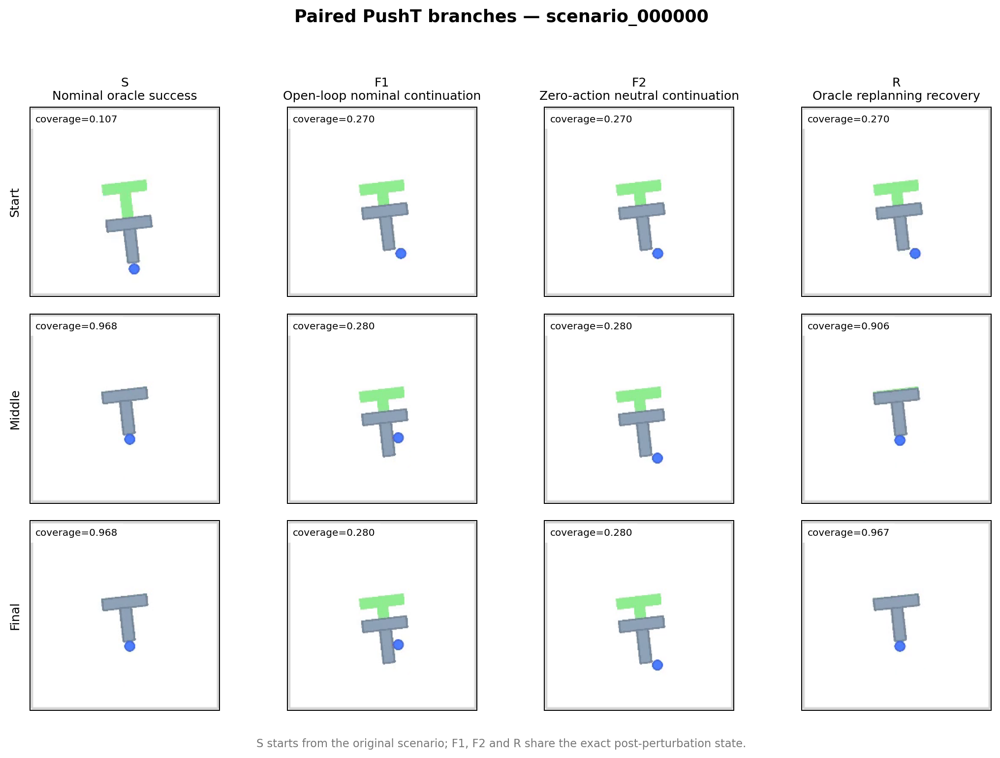
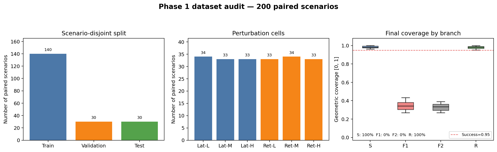
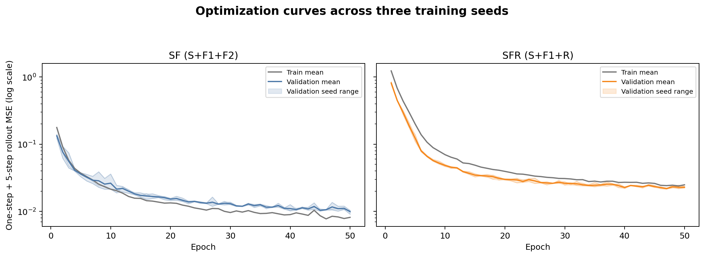
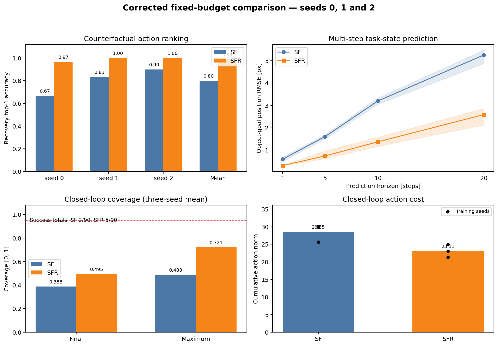
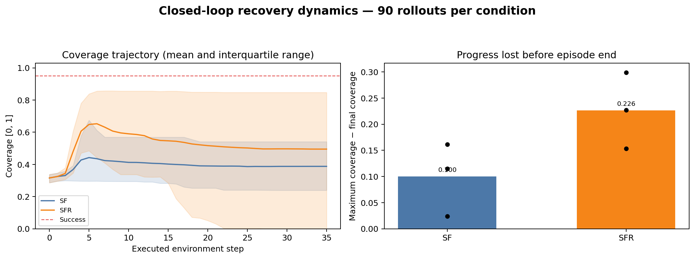

# DINO-WM Recovery Dynamics 仿真实验报告

**报告范围：** Phase 0–Phase 2，重点报告 Experiment A：Oracle-State Recovery Dynamics  
**实验日期：** 2026-09-14  
**实验状态：** 三个训练随机种子已完成；Gate A 通过，Gate B 暂未通过  
**主要代码版本：** 数据生成 `a976e2c`；校正训练 `cd99a24`；跨 seed 汇总 `a4fd07d`

## 摘要

本实验研究：在模型容量、训练预算和基础失败数据保持一致时，用具有明确恢复行为的轨迹 `R` 替换等预算的中性失败轨迹 `F2`，是否能够改善 action-conditioned world model 对恢复过程的建模和规划能力。

实验在 PushT 仿真环境中生成 200 个严格配对的场景。主要对照为：

- `D_SF_balanced = S + F1 + F2`：不包含恢复轨迹；
- `D_SFR_balanced = S + F1 + R`：用恢复轨迹替换 `F2`。

两组具有相同的场景数、轨迹预算、训练窗口数、模型结构、优化器、训练轮数、共享归一化统计和训练随机种子。三个训练 seeds 的结果表明：

1. 恢复动作 top-1 排序准确率由 `80.0%` 提升到 `98.9%`，跨 seed × scenario bootstrap 的差值为 `+18.9` 个百分点，95% CI `[+5.6, +36.7]` 个百分点。
2. 20 步 object-goal position RMSE 由 `5.255 px` 降至 `2.589 px`，三个 seeds 均改善。
3. 闭环最大 coverage 由 `0.488` 提升至 `0.721`，差值 `+0.234`，95% CI `[+0.135, +0.340]`；动作成本也稳定下降。
4. 但闭环最终 coverage 的差值 `+0.107` 的 95% CI 为 `[-0.054, +0.254]`，成功率差值的区间也跨 0。恢复丰富模型经常先取得较高 coverage，随后又丢失进展。

因此，当前证据支持“recovery-rich data 改善恢复相关动力学预测和候选动作判断”，但尚不足以支持“它稳定提高最终闭环恢复成功率”。按照预设 Gate B，本阶段暂不进入视觉 Experiment B，应先解决规划器的 goal-retention 和模型利用问题。

## 1. 研究问题与假设

### 1.1 研究问题

在排除视觉感知误差后，恢复丰富的数据是否能够让同容量的 action-conditioned world model：

1. 更准确地预测失败状态之后的多步结果；
2. 在相同起点的 bad、neutral、recovery action sequences 中识别恢复动作；
3. 在真实仿真动力学中通过闭环模型预测实现恢复？

### 1.2 预设假设

- **H1：多步预测假设。** `D_SFR_balanced` 在 held-out failure states 上的任务相关预测误差低于 `D_SF_balanced`。
- **H2：动作排序假设。** `D_SFR_balanced` 更频繁地把 `R` 排在 `F1/F2` 前面，且 selection regret 更小。
- **H3：闭环恢复假设。** 在相同规划器和仿真快照下，`D_SFR_balanced` 提高成功率和最终 coverage。

H1、H2 得到支持；H3 仅在 peak coverage 和 action cost 上得到支持，在最终成功率和 final coverage 上尚未得到稳健支持。

## 2. 实验范围与边界

本报告对应 **Experiment A**。模型输入为完整的 oracle state 和动作，不使用 RGB，也不使用 DINO encoder。这样做是为了先隔离并验证 recovery data 对动力学学习本身的影响。

本实验仍属于 DINO-WM 框架：状态与动作分别编码为 token，并复用 DINO-WM 的 causal ViT temporal predictor、autoregressive rollout 和 planning 接口；但这里不声称视觉 representation 已得到改善。冻结 DINO 特征及视觉 temporal representation 属于后续 Experiment B，尚未开始。

仿真阶段不依赖 UR5。当前结论仅适用于受控的 PushT goal-aligned translation domain，不覆盖任意物体旋转、物体外生位移或真实机器人误差。

## 3. 仿真环境与数据生成

### 3.1 PushT 任务

二维圆形 agent 推动 T 形物体，使其与绿色目标 T 的几何重叠率达到至少 95%。环境使用：

| 设置 | 数值或范围 |
|---|---:|
| RGB 分辨率 | `224 × 224 × 3` |
| 控制频率 | `10 Hz` |
| 物理仿真频率 | `100 Hz` |
| 成功阈值 | `coverage ≥ 0.95` |
| 动作 | 二维 bounded relative displacement command |
| 动作范围 | 每维 `[-1, 1]` |
| 动作缩放 | `1 command unit = 100 simulator pixels` |
| Nominal horizon | 50 actions / 51 observations |
| Counterfactual branch horizon | 35 actions / 36 observations |
| 训练窗口 | 21 states + 20 actions |

场景采样范围：

| 参数 | 范围 |
|---|---:|
| Goal x | `[220, 292] px` |
| Goal y | `[165, 215] px` |
| Goal angle | `[-0.20, 0.20] rad` |
| 物体到目标初始距离 | `[70, 100] px` |
| Agent 初始后方安全距离 | `139 px` |
| 施加扰动的 nominal progress | 目标值 `0.35` |
| 数据生成 seed | `20260914` |

### 3.2 扰动设置

Pilot 使用两类 agent perturbation：

| 扰动类型 | 含义 | Low | Medium | High |
|---|---|---:|---:|---:|
| `agent_lateral` | 将 agent 沿目标运动方向的法向侧移 | 30 px | 55 px | 80 px |
| `agent_retreat` | 将 agent 沿推动方向的反方向后撤 | 30 px | 55 px | 80 px |

六个“扰动类型 × 强度”单元各包含 33 或 34 个场景，保持近似完全平衡。扰动是显式外生事件，不作为普通 action-conditioned transition 写入训练序列；训练 branch 从扰动后的新片段开始。

### 3.3 `S/F1/F2/R` 的定义

| 分支 | 完整含义 | 起点 | 控制方式 | 预期作用 |
|---|---|---|---|---|
| `S` | Success / nominal success | 原始初始状态 | Oracle 闭环控制 | 提供正常成功动力学 |
| `F1` | Failure 1 / open-loop nominal continuation | 扰动后快照 | 继续执行扰动前剩余 nominal actions | 表示“环境变了但计划不变”的典型失败 |
| `F2` | Failure 2 / neutral continuation | 与 F1/R 完全相同的扰动后快照 | 35 步零动作 | 等预算非恢复控制，避免仅因增加第三条轨迹而获益 |
| `R` | Recovery continuation | 与 F1/F2 完全相同的扰动后快照 | Oracle 重新规划并闭环恢复 | 提供状态偏离后如何恢复的动力学覆盖 |

`F1/F2/R` 的完整 simulator snapshot 初值逐字段完全相同，包括 agent/block pose、线速度、角速度、目标 pose、阻尼、任务阈值和随机状态。实测最大绝对 branch error 为 `0.0`。

下图展示测试场景 `scenario_000000`。灰色 T 为物体、绿色 T 为目标、蓝点为 agent。`S` 从原始状态开始；`F1/F2/R` 从同一扰动后状态开始，因此后三列可作严格 counterfactual 比较。



### 3.4 数据集规模、划分与防泄漏

| 项目 | 数值 |
|---|---:|
| Paired scenarios | 200 |
| 轨迹总数 | 800（每个场景四个分支） |
| 视频总数 | 800 |
| 数据集大小 | 约 21 MB |
| Train / validation / test | 140 / 30 / 30 scenarios |
| 划分单位 | `scenario_id/pair_id` |
| Window 生成时机 | 场景划分之后 |

同一 pair 的所有分支始终属于同一个 split，不会出现 `S` 在 train 而对应 `R` 在 test 的泄漏。归一化统计也只由指定的训练分支计算。



### 3.5 数据质量审计

| 审计项 | 结果 |
|---|---:|
| Gate A | 通过 |
| Snapshot branch 最大误差 | `0.0` |
| 动作越界数 | `0` |
| 时间对齐错误数 | `0` |
| 审计错误 / 警告 | `0 / 0` |
| `S/F1/F2/R` 最终成功率 | `1.0 / 0.0 / 0.0 / 1.0` |
| `R − F1` 最终 coverage | `+0.6351` |
| 上述差值 95% bootstrap CI | `[+0.6287, +0.6414]` |

此处 `S/R` 与 `F1/F2` 的完全分离说明数据生成器制造出了强恢复信号，但也意味着当前 pilot 相对受控，不能直接外推到更复杂扰动。

## 4. 数据集配置及其区别

生成器同时建立了 additive 和 fixed-budget variants：

| Variant | 分支 | 每 200 场景的轨迹数 | Train windows | 用途与区别 |
|---|---|---:|---:|---|
| `D_S` | `S` | 200 | 4,340 | 仅 nominal success，缺少失败后状态 |
| `D_SF` | `S + F1` | 400 | 6,580 | 在成功数据上增加 open-loop failure |
| `D_SFR` | `S + F1 + R` | 600 | 8,820 | Additive recovery-rich 数据 |
| `D_SF_balanced` | `S + F1 + F2` | 600 | 8,820 | **主要 control**：第三条为零动作失败/中性 continuation |
| `D_SFR_balanced` | `S + F1 + R` | 600 | 8,820 | **主要 treatment**：用 `R` 替换 `F2` |

当前数据中 `D_SFR` 与 `D_SFR_balanced` 的内容相同；后缀 `balanced` 表示它被用于与同预算的 `D_SF_balanced` 对照。本文的校正三-seed结果只报告这两个 fixed-budget variants，尚未把所有 additive variants 完整训练到同等统计规模。

按 trajectory 的最终 success 标签统计，`D_SF_balanced` 为 200 success / 400 failure，`D_SFR_balanced` 为 400 success / 200 failure。这一变化正是把 `F2` 替换为 `R` 后产生的 recovery-data manipulation，而不是额外输入给模型的分类标签；训练损失只监督条件状态转移。

### 4.1 为什么主要比较是严格等预算的

`D_SF_balanced` 和 `D_SFR_balanced` 都包含：

- 相同的 200 个 scenario IDs；
- 每个场景三条训练候选轨迹；
- 相同的 8,820/1,890 train/validation windows；
- 相同训练步数、网络参数量与 seeds；
- 共同分支 `S + F1`；
- 唯一区别是第三个分支为 `F2` 还是 `R`。

因此差异不能简单归因于“看到更多 transition”。它检验的是：把一份等量的非恢复 continuation 替换为 recovery continuation 是否有额外价值。

### 4.2 模型会不会学习失败动作

StateWorldModel 不是 behavior cloning policy。训练目标不是“看见状态后复现数据动作”，而是学习：

\[
\hat{s}_{t+1}=f_\theta(s_{\leq t},a_{\leq t})
\]

即在给定动作的条件下预测下一状态。因此 `F1/F2` 教给模型的是“这些动作会造成什么结果”，并不要求规划器模仿失败动作。评估时 CEM 显式搜索低 task cost 的动作序列。不过，如果训练数据只覆盖失败动作而缺少恢复动作，模型可能无法准确预测 recovery action 的后果；这正是加入 `R` 的理论动机。

## 5. Oracle state、模型与训练设置

### 5.1 11 维 oracle state

| 维度 | 内容 | 单位 | 作用 |
|---:|---|---|---|
| 0–1 | agent position − object position | px | 描述 agent 相对物体的位置 |
| 2–3 | object position − goal position | px | 描述主要任务位置误差 |
| 4–5 | `sin/cos(object-goal angle error)` | 无量纲 | 连续表示周期角度误差 |
| 6–7 | agent linear velocity | px/s | 保留接触前后的 Markov 动力学信息 |
| 8–9 | object linear velocity | px/s | 描述物体运动趋势 |
| 10 | object angular velocity | rad/s | 描述旋转动力学 |

目标相对状态避免模型依赖绝对桌面坐标；速度和角速度使接触状态更接近 Markov state。

### 5.2 StateWorldModel 结构

| 参数 | 设置 |
|---|---:|
| State dimension | 11 |
| Action dimension | 2 |
| Maximum temporal context | 20 |
| State embedding | 64 |
| Action embedding | 32 |
| Transformer/model dimension | 128 |
| Causal ViT depth | 4 |
| Attention heads | 4 |
| Per-head dimension | 32 |
| MLP dimension | 256 |
| Dropout | 0.1 |
| 参数量 | 580,587 |

每个时刻将 state/action embeddings 拼接、投影为一个 temporal token，由 causal ViT predictor 预测 residual state update。模型可从单个当前状态开始自回归 rollout 多步。

### 5.3 两个主要配置的唯一数据差异

| 配置 | Raw train branch windows | Weighted sampler 后的目标分支权重 |
|---|---|---|
| `D_SF_balanced` | `S: 4340, F1: 2240, F2: 2240` | S/F1/F2 等概率 |
| `D_SFR_balanced` | `S: 4340, F1: 2240, R: 2240` | S/F1/R 等概率 |

S 的轨迹较长，因此 raw windows 较多。训练使用 inverse-frequency `WeightedRandomSampler`，避免 S 因窗口数量较多而主导梯度。

### 5.4 共同训练超参数

| 参数 | 设置 |
|---|---:|
| Training seeds | `0, 1, 2` |
| Epochs | 50 |
| Batch size | 128 |
| Optimizer | AdamW |
| Learning rate | `3 × 10⁻⁴` |
| Weight decay | `1 × 10⁻⁴` |
| Gradient clipping | L2 norm ≤ 1.0 |
| Data-loader workers | 4 |
| Device | 单张 GPU；实际为 4090node1 |
| Checkpoint selection | 最低 total validation loss |
| 1-step loss weight | 1.0 |
| 5-step autoregressive rollout loss weight | 1.0 |

总损失为：

\[
\mathcal{L}=\operatorname{MSE}(\hat{s}_{t+1},s_{t+1})
+\operatorname{MSE}(\hat{s}_{t+1:t+5}^{rollout},s_{t+1:t+5})
\]

两种配置共用由 `D_SF = S + F1` 的 12,180 个训练帧计算的 normalization statistics。每一维标准差设置最小物理尺度 1.0，防止受控 translation domain 中几乎恒定的角度维被数值噪声放大。这样避免了早期实验中“不同 variant 使用不同 normalizer”的 preprocessing confound。



图中 validation loss 的趋势用于确认优化收敛，不能直接作为 SF 与 SFR 的优劣指标：两组 validation branches 不同，SFR 包含接触恢复过程，目标分布更复杂。三个 seeds 的最佳 validation loss 如下：

| Seed | SF | SFR |
|---:|---:|---:|
| 0 | 0.01009 | 0.02171 |
| 1 | 0.01021 | 0.02148 |
| 2 | 0.00909 | 0.02183 |

## 6. 配置演进与不同设置的实际情况

### 6.1 模型训练配置演进

| 阶段 | Normalization | Loss | Seeds | 观察 | 是否作为主结论 |
|---|---|---|---:|---|---|
| 初始 pilot `a98096d` | 每个 variant 单独统计 | 仅 1-step loss | 0 | ranking `0.633 → 1.000`；20-step object-goal RMSE `6.20 → 2.09 px` | 否；存在 normalization confound，且仅一个 seed |
| Common-normalization control | 共同 `D_SF` train-only stats | 1-step loss | 调试 | 去除不同 preprocessing 的解释 | 仅中间控制 |
| 校正主实验 `cd99a24` | 共同 `D_SF` stats + std floor | 1-step + 5-step rollout loss | 0/1/2 | 离线优势稳定；闭环结果 seed-sensitive | **本文主结果** |

### 6.2 Planner 配置演进

| Planner 设置 | Horizon / repeat | CEM samples / top-k / iterations | Cost 设置 | 使用情况与结果 |
|---|---|---|---|---|
| 初始长 rollout | `12 / 3` | `256 / 32 / 4` | action `0.02`；smooth `0.01`；staging `0.25` | 旧 seed-0 checkpoints 上 SF/SFR 成功 `0/30 → 1/30`，final coverage `0.360 → 0.402`；预测出现接近目标但真实状态未改善，说明模型 exploitation |
| 扩大长 horizon | `20 / 4` | `512 / 64 / 6` | action `0.005`；smooth `0.005` | 只在 5 个 calibration scenarios 上运行；coverage 提高但 `0/5` 成功，计算更重且仍会累积模型误差 |
| 长 horizon + staging shaping | `20 / 4` | `512 / 64 / 6` | 同上，staging `0.25` | 5 场景平均 final coverage 回落到约 `0.369`，未采用 |
| **最终短 horizon feedback** | **`4 / 4`** | **`256 / 32 / 4`** | action **`0.01`**；smooth **`0`**；staging **`1.0`** | 每个真实环境 step 都重新规划；减少长 rollout exploitation；用于本文三-seed闭环结果 |

最终规划器的 horizon 4 中只有一个独立 control block，该动作在预测 horizon 内重复 4 次；但环境只执行第一个动作，随后从真实新状态重新规划。每个场景最多执行 35 步。

需要强调：短 horizon 参数曾在当前 test scenarios 的前 5 个场景上校准，因此本报告的闭环结果属于 pilot evidence，不是完全 untouched 的 confirmatory test。后续不得继续使用这 30 个测试场景调参。

## 7. 评估指标及含义

### 7.1 多步状态预测指标

所有模型都在同一组 30 个 test pairs 上评估，而且统一使用 `S/F1/F2/R` 四个分支，不因训练 variant 改变测试样本。

| 指标 | 定义 | 含义 | 越大/越小越好 |
|---|---|---|---|
| `agent_object_position_rmse_px` | agent-object 二维相对位置的 RMSE | 模型是否预测 agent 相对物体的位置 | 越小越好 |
| `object_goal_position_rmse_px` | object-goal 二维相对位置的 RMSE | 最直接的任务位置预测误差 | 越小越好 |
| `angle_mae_rad` | 由 sin/cos 恢复角度后的绝对角误差均值 | 物体相对目标朝向预测误差 | 越小越好 |
| `agent_velocity_rmse` | agent 两维速度 RMSE | agent 运动动力学误差 | 越小越好 |
| `object_velocity_rmse` | object 两维速度 RMSE | 物体平移动力学误差 | 越小越好 |
| `object_angular_velocity_rmse` | 物体角速度 RMSE | 旋转动力学误差 | 越小越好 |
| `task_error_mae` | 预测 task error 与真实 task error 的 MAE | 预测任务代价是否准确 | 越小越好 |

位置/速度 RMSE 的通用定义为：

\[
RMSE=\sqrt{\frac{1}{N}\sum_i(\hat{y}_i-y_i)^2}
\]

用于 ranking 和 planning 的无量纲 task error 为：

\[
E(s)=\frac{\|p_{object}-p_{goal}\|_2}{100}
+\frac{|\Delta\theta|}{\pi}
\]

### 7.2 Counterfactual action ranking 指标

对每个 test pair，从完全相同的 post-perturbation state 分别 rollout 真实 `F1/F2/R` action sequences，然后比较模型预测的最终 task error。

| 指标 | 定义 | 含义 | 越大/越小越好 |
|---|---|---|---|
| Recovery top-1 accuracy | 模型把 `R` 预测为三者中最低 task error 的 pair 比例 | 是否识别出 recovery sequence | 越大越好 |
| Recovery margin | `min(预测 E_F1, 预测 E_F2) − 预测 E_R` | R 相对最佳非恢复分支的预测优势；正值支持 R | 越大越好 |
| Selection regret | 被模型选中分支的真实 error − 三分支真实最优 error | 错选动作造成的实际代价 | 越小越好 |

这里的 top-1 accuracy 不是动作分类器准确率，而是 world model 根据动作后果进行 counterfactual ranking 的正确率。

### 7.3 闭环恢复指标

| 指标 | 定义 | 含义 | 越大/越小越好 |
|---|---|---|---|
| Success rate | 最终达到 `coverage ≥ 0.95` 的 rollout 比例 | 最严格的任务完成指标 | 越大越好 |
| Final coverage | 最后一步物体与目标的几何交集面积 / 目标面积 | 结束时保留了多少任务进展 | 越大越好 |
| Maximum coverage | 整条 rollout 中出现过的最高 coverage | 规划器曾经到达的最佳状态 | 越大越好 |
| Mean steps | 成功前步数；失败样本记为完整 35 步 | 恢复速度，但成功率很低时解释力有限 | 成功条件下越小越好 |
| Action cost | `Σ_t ||a_t||₂` | 累积动作幅度/控制消耗 | 越小越好，但不能脱离成功率单独解释 |
| Coverage loss | `maximum coverage − final coverage` | 到达较好状态后又丢失的进展 | 越小越好 |

### 7.4 置信区间

- 单个训练 seed：在相同的 30 个 scenario pairs 上做 10,000 次 paired bootstrap。
- 三-seed汇总：使用 10,000 次 crossed bootstrap，同时重采样训练 seed 和 scenario ID，避免把同一测试场景在三个模型初始化下的 90 次 rollout 错当成完全独立样本。
- Prediction RMSE 的跨 seed 区间是对三个 seed-level差值的 bootstrap；由于只有三个训练 seeds，这类区间只能作为 pilot uncertainty，不能替代更多独立 seeds。

## 8. 实验结果

### 8.1 三-seed总体图



### 8.2 多步 object-goal position prediction

| Horizon | 样本数/模型 | SF RMSE (px) | SFR RMSE (px) | 绝对降低 | 相对降低 |
|---:|---:|---:|---:|---:|---:|
| 1 | 4,650 | 0.598 | 0.313 | 0.285 | 47.7% |
| 5 | 4,170 | 1.607 | 0.741 | 0.866 | 53.9% |
| 10 | 3,570 | 3.201 | 1.374 | 1.827 | 57.1% |
| 20 | 2,370 | 5.255 | 2.589 | 2.666 | 50.7% |

任务相关位置误差在四个 horizons 和三个训练 seeds 上均降低，说明加入 `R` 后，模型对 failure-to-recovery 区域中的长 rollout 预测更准确。

### 8.3 20 步完整状态指标

| 指标 | SF | SFR | 差值方向 |
|---|---:|---:|---|
| Agent-object position RMSE (px) | 7.767 | 3.259 | SFR 降低 4.507 |
| Object-goal position RMSE (px) | 5.255 | 2.589 | SFR 降低 2.666 |
| Angle MAE (rad) | 0.0442 | 0.0316 | 均值改善，但并非每个 seed 都改善 |
| Agent velocity RMSE | 4.200 | 2.951 | SFR 降低 1.249 |
| Object velocity RMSE | 6.065 | 3.823 | SFR 降低 2.242 |
| Object angular velocity RMSE | 0.0629 | 0.0625 | 基本持平，seed 间方向不一致 |
| Task-error MAE | 0.0368 | 0.0262 | SFR 降低 0.0106 |

结果并不是所有状态维度都一致改善。特别是 angle 和 angular velocity 在 seed 2 或部分 horizons 上可能变差；当前最稳定的收益集中在平移任务相关坐标和速度。

### 8.4 Counterfactual ranking

| 指标 | SF | SFR | 配对差值或降低 | 95% crossed-bootstrap CI |
|---|---:|---:|---:|---:|
| Recovery top-1 accuracy | 0.800 | 0.989 | `+0.189` | `[+0.056, +0.367]` |
| Recovery margin | — | — | `+0.143` | `[+0.021, +0.262]` |
| Selection regret | — | — | `−0.094` | reduction `[+0.026, +0.186]` |

三个 seeds 的 top-1 accuracy 分别为：

| Seed | SF | SFR | 差值 |
|---:|---:|---:|---:|
| 0 | 0.667 | 0.967 | +0.300 |
| 1 | 0.833 | 1.000 | +0.167 |
| 2 | 0.900 | 1.000 | +0.100 |

这支持 H2：recovery-rich model 更可靠地预测 `R` 会产生优于 `F1/F2` 的最终结果。

### 8.5 闭环恢复结果

| Seed | Success SF / SFR | Final coverage SF / SFR | Max coverage SF / SFR | Action cost SF / SFR |
|---:|---:|---:|---:|---:|
| 0 | `0/30 / 4/30` | `0.395 / 0.585` | `0.419 / 0.739` | `30.12 / 24.95` |
| 1 | `1/30 / 1/30` | `0.428 / 0.418` | `0.544 / 0.717` | `29.88 / 23.04` |
| 2 | `1/30 / 0/30` | `0.340 / 0.482` | `0.501 / 0.709` | `25.64 / 21.33` |

三-seed汇总：

| 指标 | SF | SFR | 配对差值 | 95% crossed-bootstrap CI | 判断 |
|---|---:|---:|---:|---:|---|
| Success rate | 0.022 (`2/90`) | 0.056 (`5/90`) | +0.033 | `[-0.067, +0.156]` | 不稳健 |
| Final coverage | 0.388 | 0.495 | +0.107 | `[-0.054, +0.254]` | 不稳健 |
| Maximum coverage | 0.488 | 0.721 | +0.234 | `[+0.135, +0.340]` | 稳健改善 |
| Action cost | 28.55 | 23.11 | −5.44 | `[-9.41, -1.76]` | 稳健降低 |

`2/90` 和 `5/90` 是描述性成功次数，不应把 90 次 rollout 当作 90 个独立训练重复。正式判断以 crossed bootstrap 为准。

### 8.6 为什么最大 coverage 改善但最终成功不稳定



SFR 的平均 coverage 在约第 5–6 步快速上升到更高水平，证明其模型预测能够帮助规划器进入更有利状态。但之后 coverage 缓慢回落：

- SF 的平均 `max − final coverage` 为约 `0.100`；
- SFR 的平均 `max − final coverage` 为约 `0.226`。

因此主要问题不是“完全找不到恢复方向”，而是当前短 horizon cost 和 replanning interface 缺少可靠的 goal-retention/停止机制：物体接近目标后，新的短视野动作仍可能把物体推离已有好状态。另一方面，长 horizon 又容易累积 world-model error 并被 CEM 利用。这解释了为何离线 ranking、peak coverage 与动作成本稳定改善，但最终 success/final coverage 仍然 seed-sensitive。

## 9. 结论与 Gate 判断

### 9.1 得到支持的结论

1. **Recovery-rich data 改善了任务相关动力学。** 在严格等预算、共享 normalization 和相同模型容量下，SFR 在 object-goal position、agent-object position、线速度和 task error 的多步预测上整体优于 SF。
2. **Recovery-rich data 改善了 counterfactual action evaluation。** 三个 seeds 的 recovery top-1 accuracy 均提高，跨 seed × scenario 区间不跨 0。
3. **模型获得了可用于控制的部分信号。** SFR 在闭环中达到的 maximum coverage 显著更高，且使用更低的累计动作成本。

### 9.2 尚未得到支持的结论

不能声称 SFR 已稳定提高最终闭环恢复成功率。Success rate 和 final coverage 的跨 seed 区间均跨 0，seed 1 没有 final coverage 增益，seed 2 的成功次数还少于 SF。

### 9.3 Gate B

预设 Gate B 要求 `D_SFR_balanced` 同时改善：

1. counterfactual ranking；
2. 闭环最终恢复表现；
3. 并报告不确定性。

当前第 1 项通过，第 2 项只在 peak coverage/action cost 上通过，在 success/final coverage 上未通过。因此：

> **Gate B 暂不通过；项目应留在 Phase 2，不进入大规模视觉 Experiment B。**

## 10. 局限性与有效性威胁

1. **受控任务域。** Pilot 只包含 goal-aligned translation、agent lateral 和 retreat perturbations，不包含 object displacement、rotation 或新形状。
2. **恢复标签过于整齐。** 数据中 `S/R` 成功率为 100%，`F1/F2` 为 0%，有利于 feasibility 验证，但可能高估真实场景中的可分性。
3. **只有三个训练 seeds。** Crossed bootstrap 已同时考虑 seed 和 scenario，但三个 seed 对模型初始化方差的估计仍较粗。
4. **Planner calibration 泄漏。** 最终短 horizon 配置曾观察当前 test set 的前 5 个场景，因此当前闭环结果必须标记为 pilot，而非最终 confirmatory result。
5. **Planner 与模型耦合。** Offline branch ranking 只比较数据中已有 action sequences；CEM 必须搜索新的动作，容易进入训练分布外并利用模型误差。
6. **成功事件稀少。** SF/SFR 只有 2/90 和 5/90 次成功，success-rate估计不稳定；coverage 提供了更连续的信息，但不能替代最终任务完成率。
7. **Experiment A 不涉及视觉。** 本报告不能证明 DINO representation 已改善，也不能直接外推到像素输入或真实机器人。

## 11. 下一步实验建议

1. 在 validation scenarios 上分析 `max coverage` 到 `final coverage` 的下降轨迹、动作方向和模型预测代价。
2. 为 planner 加入显式 no-op 候选、只接受预测改进动作的 safeguard、接近目标后的 hold/termination cost，以及 trajectory-wide cost，而不是只看预测终点。
3. 使用 ensemble/disagreement 或 rollout uncertainty 抑制 CEM 对分布外模型误差的利用。
4. 所有 planner 调参只使用 validation split；配置锁定后生成新的 simulator confirmatory test pairs，不再使用本报告的 30 个 test pairs 调参。
5. 在 fresh test 上重新运行至少三个 seeds。只有 success/final coverage 的配对区间也显示可信改善，才通过 Gate B 并进入 Experiment B。
6. Gate B 通过后，再实现 frozen DINO tokens → temporal adapter/predictor → contextual representation，并与 raw DINO、random adapter 和 oracle-state upper bound 比较。

## 12. 可复现性与产物

### 12.1 关键远端路径

```text
Dataset:
/mnt/slurmfs-4090node3/user_data/yguo704/dino_wm_dataset/pusht_recovery_phase1_pilot_v1

Corrected Phase 2 runs:
/mnt/slurmfs-4090node3/user_data/yguo704/dino_wm_dataset/phase2_runs/fixed_common_rollout_cd99a24

Three-seed aggregate:
/mnt/slurmfs-4090node3/user_data/yguo704/dino_wm_dataset/phase2_runs/fixed_common_rollout_cd99a24/three_seed_aggregate.json
```

### 12.2 SLURM 作业

| 用途 | Seed 0 | Seed 1 | Seed 2 |
|---|---|---|---|
| SF training | 16191 | 16195 | 16199 |
| SFR training | 16192 | 16196 | 16200 |
| SF closed-loop | 16193 | 16197 | 16201 |
| SFR closed-loop | 16194 | 16198 | 16202 |

所有上述作业均在 `4090node1` 完成并以 exit code `0` 退出。数据生成作业为 `16174`，运行于 `4090node3`。

### 12.3 关键命令

训练脚本通过以下形式运行，其中两个 variants 都显式使用 `D_SF` 的共享训练归一化：

```bash
scripts/slurm_train_state_wm.sh D_SF_balanced  <seed> fixed_common_rollout_cd99a24 D_SF
scripts/slurm_train_state_wm.sh D_SFR_balanced <seed> fixed_common_rollout_cd99a24 D_SF
```

正式 pilot 的短 horizon 闭环参数为：

```text
--cem-horizon 4
--cem-action-repeat 4
--cem-samples 256
--cem-topk 32
--cem-iterations 4
--cem-action-cost 0.01
--cem-smoothness-cost 0
--cem-staging-weight 1.0
```

跨 seed 汇总：

```bash
python aggregate_state_wm.py \
  --run-dir "$DATASET_DIR/phase2_runs/fixed_common_rollout_cd99a24" \
  --seeds 0 1 2 \
  --output "$DATASET_DIR/phase2_runs/fixed_common_rollout_cd99a24/three_seed_aggregate.json"
```

### 12.4 本地报告产物

- 本报告：`Experiment_Report_Phase2.md`
- 配对轨迹图：`report_assets/phase1-branch-montage.png`
- 数据集审计图：`report_assets/phase1-dataset-summary.png`
- 训练曲线：`report_assets/phase2-training-curves.png`
- 主要结果图：`report_assets/phase2-main-results.png`
- Coverage dynamics：`report_assets/phase2-coverage-dynamics.png`
- 图表生成脚本：`scripts/generate_phase2_report_assets.py`
