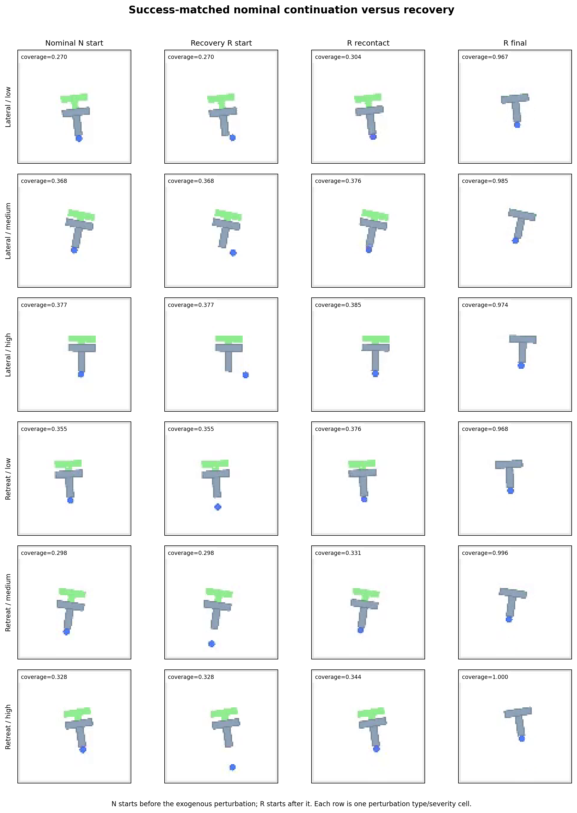
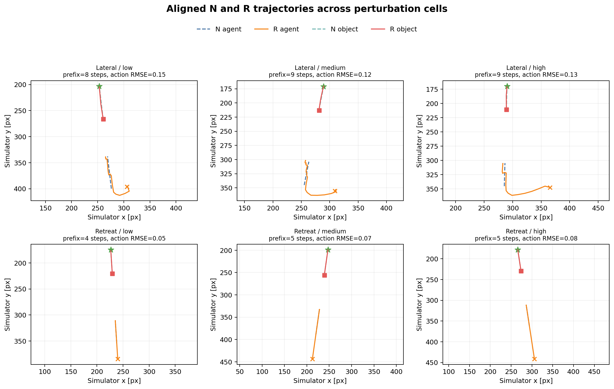

# PushT Recovery-specific Attribution 小规模实验报告

**实验日期：** 2026-09-15
**研究阶段：** Phase 2 / Experiment A 归因补充实验
**核心比较：** `D_SFN_balanced` 与 `D_SFR_balanced`
**性质：** 三训练种子的 feasibility pilot，不是最终 confirmatory experiment

## 1. 实验目的与结论摘要

原始 `SF`/`SFR` 比较存在一个合理疑问：`SFR` 含有更多成功轨迹，所以性能提升可能只是“更多成功示例”，而不是 recovery state/action 本身带来的价值。

本实验为每个场景增加成功的 nominal continuation `N`，使两组数据拥有完全相同的轨迹数、成功/失败数、窗口数和训练预算：

```text
SFN = S + F1 + N   # 成功匹配控制组：N 位于 nominal manifold
SFR = S + F1 + R   # recovery 组：R 从 post-perturbation state 恢复
```

三训练种子结果表明：在排除成功样本数量差异后，`SFR` 仍显著改善 R 分支和恢复动作前缀的多步预测，并稳定改善 counterfactual ranking。这支持 **recovery-specific data 对恢复动力学学习有额外价值**，而不只是增加成功样本。

但闭环最终成功率没有提升，final coverage 的区间也跨 0。因此当前只能确认动力学与候选动作判断信号，**不能宣称恢复数据已经稳定提高任务完成率，Gate B 仍未通过**。

## 2. 轨迹设计

### 2.1 扰动确实发生在 nominal 轨迹中段

每个场景先执行完整 nominal trajectory `S`。生成器根据 object-goal 距离选择约 **35% nominal progress** 的状态作为分支点，然后施加外生 agent 扰动。因此实现已经符合“先沿 S 推动一段、轨迹偏离、再由 R 恢复”的思路。

此前可视化让 R 看起来只是“开头动一下再继续推”，主要有两个原因：

1. `R.mp4` 从 post-perturbation branch point 开始，不重复播放前面的 S 前缀；
2. 当前扰动只移动 agent，不移动物体；oracle 平均用 6.685 步重新定位/接触，然后继续推动，所以恢复前缀只占 35 步分支的 19.1%。

### 2.2 五类轨迹

| 分支 | 起点 | 动作 | 数据含义 |
|---|---|---|---|
| `S` | 场景初始状态 | oracle nominal policy | 完整正常成功轨迹 |
| `N` | 扰动前 snapshot | 同一 oracle，35 步 | 成功的 on-manifold nominal continuation；用于控制成功样本数量 |
| `F1` | 完全相同的扰动后 snapshot | 继续执行扰动前 open-loop plan | 环境已变但旧计划不变的失败 |
| `F2` | 完全相同的扰动后 snapshot | 35 步零动作 | 等预算 neutral failure |
| `R` | 完全相同的扰动后 snapshot | oracle closed-loop replanning | 重新定位、重新接触、纠正推动和保持 |

外生扰动 transition 不作为普通 action-conditioned transition 训练。`F1/F2/R` 的初始物理状态逐值一致；`N` 的初始状态与 `S` 在分支点逐值一致。

## 3. 数据集设置与审计

| 项目 | 设置 |
|---|---|
| 环境 | PushT 二维仿真，goal-aligned translation pilot |
| 场景数 | 200 paired scenarios |
| 划分 | train/validation/test = 140/30/30，先按 scenario 划分再生成窗口 |
| 扰动时机 | 约 35% nominal progress |
| 扰动类型 | `agent_lateral`、`agent_retreat` |
| 严重度 | low/medium/high = 30/55/80 simulator pixels |
| 六个扰动单元 | 2 types × 3 severities，数量平衡 |
| S horizon | 50 actions |
| N/F1/F2/R horizon | 各 35 actions |
| 训练窗口 | 20 actions + 21 states |
| RGB | 224×224；本 Experiment A 只训练 oracle-state model，RGB 仅用于审计/可视化 |
| action | 二维 relative command，范围 `[-1,1]`，1 command unit = 100 simulator pixels |
| oracle state | 11 维：agent-object、object-goal、角度 sin/cos、agent/object 速度及物体角速度 |

权威数据集位于：

```text
$DATASET_DIR/pusht_recovery_phase1_pilot_v2
```

审计结果：

- Gate A 通过，errors/warnings 均为空；
- counterfactual branch state error、N-to-S snapshot error、action violation、temporal alignment violation 均为 0；
- `S/N/R` 成功率均为 1.0，`F1/F2` 成功率均为 0.0；
- `SFN` 与 `SFR` 各含 400 条成功和 200 条失败轨迹；
- 两组 train/validation/test 窗口数完全相同：8,820 / 1,890 / 1,890；
- 对齐的 R/N action RMSE 为 0.104 command units；agent-object RMSE 为 11.04 px；object-goal RMSE 为 12.75 px；说明 R 与 N 不是同一条成功轨迹的复制。

## 4. 数据可视化

下图每一行对应一种 perturbation type × severity。每行从同一场景的 branch point 对齐展示 `N` 和 `R`，而不是只挑选一个 low-severity 样本。



轨迹叠加图显示 agent 与物体在 N/R 中的空间路径。R 的早期 reposition/recontact 路径与 N 不同，随后才重新进入推动阶段。



这些图用于证明数据构造和差异存在，不代替 200 场景的数值审计。

## 5. 模型与训练配置

两组均使用同一个 580,587 参数 `StateWorldModel`：11 维 state 和 2 维 action 分别编码后送入原 DINO-WM causal ViT predictor family，再预测 residual next state。本实验不调用 DINO image encoder，因此结论仅针对 recovery dynamics，不针对视觉表征。

| 配置 | `SFN` | `SFR` |
|---|---|---|
| 训练分支 | S + F1 + N | S + F1 + R |
| 成功/失败轨迹 | 400 / 200 | 400 / 200 |
| 训练窗口 | 8,820 | 8,820 |
| normalization | 共同使用 `D_SF` train split 统计量 | 相同 |
| 模型结构/参数量 | 相同 | 相同 |
| epochs / batch | 50 / 128 | 50 / 128 |
| optimizer | AdamW，lr `3e-4`，weight decay `1e-4` | 相同 |
| loss | 1-step MSE + 权重 1.0 的 5-step autoregressive rollout MSE | 相同 |
| training seeds | 0、1、2 | 0、1、2 |

validation loss 不宜直接跨组解释，因为 N 与 R 的验证目标难度和状态分布不同；主要判断必须基于共同 held-out post-perturbation test states。

## 6. 指标含义

### 6.1 多步预测误差

- **object-goal position RMSE (px)：** 预测的物体相对目标位置与真实位置的均方根误差，越低越好。
- **agent-object position RMSE (px)：** 预测的 agent 相对物体位置误差，直接反映重新定位/接触动力学，越低越好。
- **h-step：** 从真实起始状态输入未来动作，自回归预测 h 步后的状态；h 越大越考验长期误差累积。
- **R branch：** 只评估恢复分支，避免 nominal/failure 样本掩盖恢复误差。
- **recovery prefix：** 只从 `R` 中 phase 为 `reposition` 或 `recontact` 的窗口起点评价，是最接近“恢复动作本身”的子集。

### 6.2 Counterfactual ranking

每个 held-out pair 的 `F1/F2/R` 从完全相同的 post-perturbation snapshot 出发。

- **Recovery top-1 accuracy：** 模型是否将真实最优的 R continuation 排在第一，越高越好。
- **Recovery margin：** 最佳 failure 候选的预测 task error 减去 R 的预测 task error；越大表示越明确偏好 R。
- **Selection regret：** 模型所选候选的真实 task error 与真实最优候选之差；越低越好。报告的 regret reduction 为 `SFN - SFR`，正值表示 SFR 更好。

### 6.3 闭环规划

- **Success rate：** 仿真几何 coverage 达到 0.95 的场景比例。
- **Final coverage：** 35 步闭环结束时的覆盖率；越高越好。
- **Maximum coverage：** 整个闭环过程中达到过的最高覆盖率；可区分“没有到达目标附近”和“到达后又丢失进展”。
- **Action cost：** 35 步实际动作二范数之和；越低表示动作更省。

闭环使用 state-space CEM：预测 horizon 4、action repeat 4、256 candidates、top-k 32、4 iterations、action cost weight 0.01、smoothness weight 0、staging weight 1.0。

## 7. 三种子结果

### 7.1 Recovery-specific 多步预测

| 20-step test subset | 指标 | SFN | SFR | 降低量（SFN−SFR） | 3-seed bootstrap 95% CI |
|---|---|---:|---:|---:|---:|
| 混合 S/F1/F2/R | object-goal RMSE | 4.498 | 2.691 | 1.807 | [0.815, 2.346] |
| 混合 S/F1/F2/R | agent-object RMSE | 7.193 | 3.316 | 3.877 | [3.561, 4.360] |
| 仅 R branch（480 windows） | object-goal RMSE | 9.323 | 3.252 | 6.071 | [5.469, 6.742] |
| 仅 R branch（480 windows） | agent-object RMSE | 14.856 | 2.039 | 12.817 | [11.766, 13.356] |
| 仅 recovery prefix（185 windows） | object-goal RMSE | 14.666 | 4.532 | 10.134 | [8.783, 11.637] |
| 仅 recovery prefix（185 windows） | agent-object RMSE | 23.507 | 2.556 | 20.951 | [19.324, 21.889] |

最强改善恰好出现在 recovery prefix，而不是被 nominal segment 主导。这是本实验反驳“只因为多了成功示例”的最直接证据。

### 7.2 Counterfactual ranking

| 指标 | SFN | SFR | 配对差值 | crossed bootstrap 95% CI |
|---|---:|---:|---:|---:|
| Recovery top-1 accuracy | 0.811 | 1.000 | +0.189 | [0.067, 0.333] |
| Recovery margin | — | — | +0.132 | [0.002, 0.265] |
| Selection regret reduction | — | — | +0.096 | [0.033, 0.173] |

top-1 的逐 seed 结果为：SFN `0.800/0.767/0.867`，SFR `1.000/1.000/1.000`。这里的区间同时重采样训练 seed 和相同的 30 个 scenario ID。

### 7.3 闭环 CEM

| 指标 | SFN | SFR | 配对差值（SFR−SFN） | crossed bootstrap 95% CI |
|---|---:|---:|---:|---:|
| Success rate | 1/90 = 0.011 | 1/90 = 0.011 | 0.000 | [-0.056, 0.044] |
| Final coverage | 0.384 | 0.465 | +0.081 | [-0.106, 0.299] |
| Maximum coverage | 0.469 | 0.696 | +0.227 | [0.110, 0.361] |
| Action cost | 31.831 | 24.576 | -7.255 | [-13.472, -0.829] |

SFR planner 更经常到达较高 coverage，且用更少动作；但它没有稳定保持进展到 episode 结束，也没有提高 95% success。seed 0 的 final coverage 增益较大，seed 1/2 略为负，说明 final-state 结论对训练随机性敏感。

## 8. 结论与研究判断

### 可以支持

1. 用户提出的成功样本数量混淆是有道理的，原 `SF`/`SFR` 结果不能单独完成机制归因。
2. 在成功数量、失败数量、窗口数、模型和训练预算全部匹配后，R 数据仍明显改善 held-out recovery dynamics prediction。
3. 改善在 R branch、尤其 reposition/recontact recovery prefix 上最强，并在三个 seeds 上方向一致。
4. recovery-rich model 更可靠地从相同扰动后状态区分 recovery 与 failure actions，并提高闭环 peak coverage、降低动作成本。

### 不能支持

1. 不能声称 recovery data 已稳定提高最终 success rate 或 final coverage。
2. 不能声称 DINO visual representation 得到改善；本实验输入为 oracle state。
3. 不能外推到物体位移、旋转、新形状或真实机器人。
4. 不能把三 seed pilot 的区间当成高精度总体估计；尤其 seed bootstrap 只有三个独立训练 seeds。

### Gate 判断

Recovery-specific attribution 子问题通过：结果不再能仅由“更多成功数据”解释。严格 Gate B 仍不通过，因为最终闭环恢复成功没有形成可信提升；项目应继续停留在 Phase 2，而不是立即扩大到视觉 Experiment B。

## 9. 下一步最小改进

本研究仍是粗略 feasibility test，下一步不需要立刻增加大规模数据：

1. 只在 validation scenarios 上诊断 `maximum coverage -> final coverage` 的退化，加入 goal-retention/acceptance safeguard 或到达后的 hold/stop 机制；
2. 锁定 planner 后生成 fresh confirmatory test pairs，避免继续使用参与过 planner 校准的 30 个 test scenarios；
3. 若希望让恢复更明显，可把 branch progress 分层为 25%/50%/70%，并增加持续脱离接触或可恢复的轻微 object-pose perturbation；前提是先验证 oracle 能可靠恢复，不能为了视觉差异制造错误标签；
4. 保留 `SFN` success-matched control，继续报告 recovery-prefix 分层指标；否则后续仍会回到“更多成功示例”的混淆。

## 10. 可复现产物

```text
Dataset:
  $DATASET_DIR/pusht_recovery_phase1_pilot_v2

Run group:
  $DATASET_DIR/phase2_runs/attribution_v2_65b750f

Aggregate JSON:
  $DATASET_DIR/phase2_runs/attribution_v2_65b750f/
  three_seed_attribution_aggregate.json

Training jobs:
  seed 0: 16213 / 16214
  seed 1: 16220 / 16221
  seed 2: 16224 / 16225

Closed-loop jobs:
  seed 0: 16218 / 16219
  seed 1: 16231 / 16232
  seed 2: 16236 / 16237
```

完整运行历史见 `Progress.md`；代码边界见 `IMPLEMENTATION_OVERVIEW.md`；原始 v1 pilot 结果保留在 `Experiment_Report_Phase2.md`，作为历史基线而不是本归因实验的替代。
