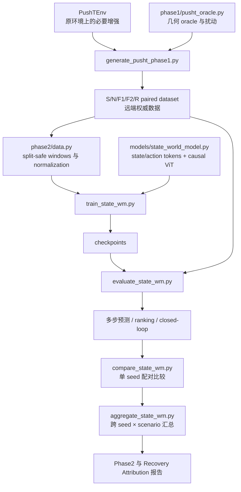

# DINO-WM Recovery 项目文件与代码索引

**整理基线：** 原始 DINO-WM 框架提交 `5b12dea`
**当前实现：** Phase 0–2 扩展与 schema-v2 success-matched attribution pilot
**用途：** 说明哪些代码属于原始框架、哪些是本项目新增、哪些原文件因实验需要被修改，以及目前可以支持什么结论。

## 1. 一句话结论

当前仓库不是“重新实现了一套 DINO-WM”，而是在原始 DINO-WM 上增加了一条独立的 recovery 实验链：

```text
PushT 仿真与严格快照
  -> S/N/F1/F2/R 配对数据
  -> oracle-state StateWorldModel
  -> 多步预测 / counterfactual ranking / 闭环 CEM
  -> 三 seed 统计与 success-matched attribution 报告
```

Phase 0、Phase 1 和 Experiment A 的三-seed pilot 已完成。恢复数据在离线动力学预测、恢复动作排序、闭环最大 coverage 和动作成本上表现出稳定优势，但最终成功率与 final coverage 的置信区间仍跨 0。因此 **Gate B 尚未通过，Experiment B 的 DINO 视觉表征模块还没有开始实现**。

## 2. 原框架与本项目扩展的边界

| 层次 | 原始 DINO-WM | 本项目 recovery 扩展 | 当前状态 |
|---|---|---|---|
| 输入 | RGB、proprioception、action | Experiment A 使用 11 维 oracle state 和二维 action | 已完成 |
| 表征 | 冻结 DINO 图像特征 | 当前没有训练或比较 DINO 表征 | 尚未进入 Experiment B |
| 时序模型 | VisualWorldModel + causal ViT | 新增 StateWorldModel，复用 causal ViT 的时序预测结构 | 已完成 |
| 环境 | 原有 PushT、PointMaze 等接口 | 明确动作语义、完整快照、几何任务评价 | 已完成 |
| 数据 | 原作者发布的任务轨迹 | v1 已生成 `S/F1/F2/R`；v2 增加成功匹配的 `N` | v2 三-seed pilot 已完成 |
| 规划 | 原有 CEM/GD/MPC | 增加物理边界裁剪；Experiment A 新增 state-space CEM 评价 | pilot 已完成 |
| 统计 | 原框架训练/规划输出 | 多 seed、配对 bootstrap、跨 seed × scenario 汇总 | 已完成 |

需要特别区分：

- `models/dino.py` 和 `models/visual_world_model.py` 是原始视觉路线的核心；当前 Experiment A **没有调用 DINO encoder**。
- `models/state_world_model.py` 是本项目新增的 oracle-state 对照模型，用于隔离 perception 误差并检验 recovery data 对动力学学习的作用。
- 因此当前结果支持 recovery dynamics 的结论，不支持“DINO visual representation 已改善”的结论。

## 3. 代码调用关系



原始视觉路线仍然独立存在：

```text
RGB -> frozen DINO encoder -> VisualWorldModel -> CEM/GD/MPC planner
```

它将在 Gate B 通过后，才会扩展为 Experiment B 的 temporal recovery representation。

## 4. 原始框架中保持不变的核心文件

以下文件来自原始 DINO-WM，当前 recovery Experiment A 没有改写其基本职责：

| 文件或目录 | 原始职责 | 与当前实验的关系 |
|---|---|---|
| `models/dino.py` | 加载并运行 DINO 视觉编码器 | Experiment A 不使用；Experiment B 预留 |
| `models/visual_world_model.py` | 在视觉 token 上进行 action-conditioned prediction | 当前不使用 |
| `models/proprio.py` | proprioception 编码 | 当前 state-only 模型不依赖该视觉路径 |
| `train.py` | 原版 Hydra 视觉世界模型训练入口 | Phase 2 使用独立的 `train_state_wm.py` |
| `conf/` | 原版训练、规划和环境配置 | 当前 Phase 2 参数由独立 CLI/SLURM 脚本控制 |
| `datasets/` 中其他数据集 | PointMaze、Wall、deformable 等原任务数据加载 | recovery 主实验只使用 PushT |
| `env/pointmaze` 等其他环境 | 原版其他任务环境 | 不属于本次 PushT recovery 结论 |

## 5. 对原始框架文件的必要修改

这些不是新的独立实验模块，而是为保证 PushT 实验可运行、可复现且动作合法而对原文件做的兼容性修改。

| 文件 | 修改内容 | 为什么需要 | 对原框架的影响 |
|---|---|---|---|
| `env/__init__.py` | 移除导入 PushT 时对 PointMaze/MuJoCo 的强制 eager import | 纯 PushT 不应被可选 MuJoCo 依赖阻塞 | 环境导入更解耦 |
| `env/pusht/__init__.py` | 对 `PushTEnv` 使用延迟导入 | 避免包初始化产生无关依赖 | 接口保持兼容 |
| `env/pusht/pusht_env.py` | 统一相对动作、裁剪、11 维 oracle state、coverage/success、完整 snapshot/restore | 支持严格 counterfactual 分叉和确定性复现 | 是 Phase 0 最关键的底层增强 |
| `env/pusht/pusht_wrapper.py` | 用物体—目标几何 coverage 评价任务，补充位置/角度误差 | 避免无关的 agent 最终位置污染成功判定 | 评价语义更符合 PushT 任务 |
| `datasets/pusht_dset.py` | 移除硬编码统计量，只用有效训练帧计算 normalization，并把 train stats 复用于 validation | 防止 padding 与 split 泄漏，并统一动作边界 | 改善原 PushT loader 的严谨性 |
| `models/vit.py` | 将 causal mask 注册为随模型移动的 buffer，不再写死 `.to('cuda')` | 支持 CPU/非默认 GPU 和可靠 checkpoint 移动 | 不改变模型数学结构 |
| `preprocessor.py` | 接收物理动作上下界，转换到 normalized space 后裁剪 | 防止预处理产生越界动作 | 对所有 planner 提供统一边界 |
| `plan.py` | 将数据集的动作上下界传入 preprocessor | 贯通数据与规划的 action convention | 原入口仍可使用 |
| `planning/cem.py` | 裁剪采样、均值更新后的动作 | 防止 CEM 利用非法动作 | 通用安全修正 |
| `planning/gd.py` | 裁剪初始化和梯度更新后的动作 | 防止优化越界 | 通用安全修正 |
| `planning/mpc.py` | 执行前再次裁剪动作 | 保证进入环境的动作合法 | 通用安全修正 |

动作定义集中在新增的 `env/pusht/action_utils.py`：二维 relative displacement command，每维范围 `[-1, 1]`，一个 command unit 对应 100 simulator pixels。环境、数据集和 planner 共享这一语义。

## 6. 本项目新增文件

### 6.1 Phase 0：运行时与确定性基础

| 文件 | 职责 | 验证状态 |
|---|---|---|
| `env/pusht/action_utils.py` | 单一来源的 action bounds、裁剪和缩放定义 | 远端测试通过 |
| `visualize_pusht_phase0.py` | 生成 PushT RGB、状态与 snapshot replay 的可视化 smoke test | replay state/RGB error 为 0 |
| `tests/test_pusht_phase0.py` | 动作、任务评价、normalization、snapshot 确定性回归测试 | 远端 7 tests passed |

### 6.2 Phase 1：配对 recovery 数据生成

| 文件 | 职责 | 验证状态 |
|---|---|---|
| `generate_pusht_phase1.py` | 数据生成 CLI；组织场景、分支、审计、manifest 和视频输出 | 已生成 200 pairs |
| `phase1/pusht_oracle.py` | goal-aligned translation 的几何 oracle、restaging 和 recovery 控制 | 当前受控域通过；rotation 尚未覆盖 |
| `phase1/pusht_dataset.py` | `S/N/F1/F2/R` 落盘、scenario-level split、variant/window index、结构与 R/N 差异审计 | v1 Gate A 通过；v2 验证中 |
| `phase1/README.md` | Phase 1 数据格式与使用说明 | 已完成 |
| `scripts/slurm_generate_pusht_phase1.sh` | 远端 SLURM 数据生成入口 | job `16174` 完成 |
| `tests/test_pusht_phase1.py` | 分支一致性、对齐、split 和 variant 回归测试 | 远端通过 |
| `tests/fixtures/pusht_phase1_pilot_v1/` | 一个完整场景的轻量回归 fixture，含四分支 NPZ/MP4/快照 | 可本地阅读，不替代远端全量数据 |

五个分支含义：

- `S`：原始初态上的 nominal oracle success。
- `N`：从扰动前 snapshot 开始的等 horizon nominal success continuation，用于成功数量匹配。
- `F1`：扰动后继续执行扰动前的 open-loop nominal actions。
- `F2`：从相同扰动后快照执行零动作的等预算 failure/neutral continuation。
- `R`：从同一快照重新规划并闭环恢复的 oracle continuation。

`F1/F2/R` 的起始完整 simulator snapshot 完全相同；测得最大 branch state error 为 `0.0`。训练 world model 时，失败动作是带条件的动力学样本，不是 behavior-cloning 标签。

### 6.3 Phase 2：Experiment A 状态世界模型

| 文件 | 职责 | 与原框架的区别 |
|---|---|---|
| `models/state_world_model.py` | 编码 11 维 state 与二维 action，使用 causal ViT 预测 residual state update | 新增 state-only 模型；不经过 DINO |
| `phase2/data.py` | 读取 paired dataset、构造无泄漏窗口、共享 normalization、按 branch 重采样 | 专用于 Experiment A |
| `phase2/evaluation.py` | 多步误差、任务代价、counterfactual ranking、state-space CEM 与闭环评价 | 新增 recovery 专用评价 |
| `train_state_wm.py` | StateWorldModel 训练、1-step + 5-step rollout loss、checkpoint 和日志 | 独立于原版 `train.py` |
| `evaluate_state_wm.py` | 对 checkpoint 执行离线或闭环评价 | 独立于原版视觉 `plan.py` |
| `compare_state_wm.py` | 对同 seed 的 SF/SFR 结果做 paired comparison 与 bootstrap | 新增统计入口 |
| `aggregate_state_wm.py` | 汇总 3 seeds，并对 seed 与 scenario 交叉 bootstrap | 新增最终 pilot 汇总入口 |
| `scripts/slurm_train_state_wm.sh` | 远端训练任务入口；可用 `PHASE2_DATASET_NAME` 选择 v1/v2 数据 | v1 已完成 seeds 0/1/2 |
| `scripts/slurm_eval_state_wm.sh` | 远端评估任务入口；与训练共享显式数据版本 | v1 已完成离线及闭环评价 |
| `scripts/slurm_eval_state_wm_offline.sh` | checkpoint 不变时重跑 branch/phase-stratified 离线评价 | v2 attribution 使用 |
| `tests/test_pusht_phase2.py` | loader、模型 rollout、评价和 planner 单元/集成回归 | 远端通过 |
| `tests/test_aggregate_state_wm.py` | 跨 seed 聚合和置信区间测试 | 与 Phase 2 tests 合计 10 tests passed |

### 6.4 文档、图表与进展记录

| 文件 | 定位 | 是否为权威结果 |
|---|---|---|
| `AGENTS.md` | 本地编辑、Git 同步、远端执行以及实验有效性约束 | 工作规则 |
| `Progress.md` | 每次实现、数据、作业、指标、失败和决策的时间记录 | 进展单一文字记录 |
| `Experiment_Report_Phase2.md` | 中文自包含实验报告，含设置、指标定义、结果、限制和 Gate 结论 | 当前 Phase 2 结果报告 |
| `Experiment_Report_Recovery_Attribution_v2.md` | SFN/SFR 成功数量匹配归因实验，含分支级指标与六单元可视化 | 当前机制归因报告 |
| `IMPLEMENTATION_OVERVIEW.md` | 本文件；代码边界、职责、调用关系和完成度索引 | 当前代码地图 |
| `scripts/generate_phase2_report_assets.py` | 从远端权威 JSON/数据生成静态科学图表 | 可复现图表生成逻辑 |
| `visualize_pusht_recovery_pairs.py` | 对齐展示六扰动单元的 N/R 帧与 agent/object 轨迹 | v2 smoke 已验证 |
| `report_assets/*.png` | 数据审计、训练曲线、主结果、coverage dynamics 和分支 montage | 报告内嵌产物 |
| `report_assets/phase1-v2-*.png` | v2 六单元 success-matched nominal 与 recovery 诊断 | 6-scenario smoke 产物 |

## 7. 数据、代码和生成产物应如何区分

### Git 中保存

- 源代码、测试、SLURM 脚本和 Markdown 文档。
- 一个完整的小型 paired scenario fixture，用于回归和格式检查。
- 报告需要的压缩 PNG 图表。

### 仅保存在远端数据盘

- 全量 200-pair 数据集：`$DATASET_DIR/pusht_recovery_phase1_pilot_v1`。
- success-matched 200-pair 数据集：`$DATASET_DIR/pusht_recovery_phase1_pilot_v2`。
- Phase 2 checkpoints、训练日志、逐 scenario 评价 JSON。
- 三-seed 汇总：`$DATASET_DIR/phase2_runs/fixed_common_rollout_cd99a24/three_seed_aggregate.json`。
- v2 归因汇总：`$DATASET_DIR/phase2_runs/attribution_v2_65b750f/three_seed_attribution_aggregate.json`。

远端数据盘是运行结果的权威来源；Git fixture 不能被当成完整训练集，`report_assets` 也不能替代原始 JSON。

## 8. 当前实验配置与已得到结论

主比较严格固定预算：

| 配置 | 包含分支 | 作用 |
|---|---|---|
| `D_SF_balanced` | `S + F1 + F2` | control；有成功、open-loop failure 和等预算 neutral failure |
| `D_SFN_balanced` | `S + F1 + N` | success-matched control；成功数量与 SFR 相同，但第三条保持在 nominal manifold |
| `D_SFR_balanced` | `S + F1 + R` | treatment；在 SFN/SFR 归因比较中，唯一数据类型变化是用 recovery continuation `R` 替换 nominal continuation `N` |

两者使用相同场景、窗口预算、模型容量、训练轮数、optimizer、共享 `D_SF` train-only normalization 和 seeds `0/1/2`。

关键结果：

| 指标 | SFN | SFR | 结论 |
|---|---:|---:|---|
| Recovery top-1 accuracy | 0.811 | 1.000 | `+0.189`，95% CI `[0.067, 0.333]`，成功数量匹配后仍稳定改善 |
| R-only 20-step object-goal RMSE | 9.323 px | 3.252 px | 三个 seeds 均改善，降低 6.071 px |
| Recovery-prefix 20-step agent-object RMSE | 23.507 px | 2.556 px | 最大改善出现在 reposition/recontact 状态 |
| 闭环 maximum coverage | 0.469 | 0.696 | `+0.227`，95% CI `[0.110, 0.361]` |
| 闭环 action cost | 31.831 | 24.576 | 差值 `-7.255`，95% CI `[-13.472, -0.829]` |
| 闭环 final coverage | 0.384 | 0.465 | `+0.081`，95% CI `[-0.106, 0.299]`，未形成稳健证据 |
| 闭环 success | 1/90 | 1/90 | 没有改善 |

据此可以说：即使成功轨迹数量完全相同，recovery-rich data 仍改善 recovery-relevant dynamics prediction 和候选动作判断，并帮助 planner 到达更高 peak coverage。不能说：它已经稳定提高最终闭环成功率，也不能说 DINO 视觉 representation 已改善。

## 9. 未完成项与已知技术债

- Phase 2 checklist 中 additive variants 已被数据索引支持，但当前机制归因结果只针对固定预算、成功数量匹配的 SFN/SFR。
- 当前 planner 曾用现有 test set 的前 5 个场景校准，故闭环数字属于 pilot evidence，而不是 untouched confirmatory test。
- SFR 经常先达到较高 coverage，随后丢失进展；需要 goal-retention、no-op/hold、acceptance safeguard 或 uncertainty-aware planning。
- 当前 oracle 只验证 goal-aligned translation，以及 agent lateral/retreat 扰动；object displacement、rotation、新形状和真实机器人均未验证。
- Experiment B 尚无 temporal DINO adapter、probe 或 visual closed-loop 结果。

## 10. 下一步建议

1. 只在 validation scenarios 上诊断 `max coverage -> final coverage` 的退化，并修改 planner 的保持/停止机制。
2. 锁定 planner 配置后，生成新的 confirmatory test pairs，重新运行至少三个 seeds。
3. 只有 recovery ranking 与最终闭环表现同时形成可信改善，才通过 Gate B。
4. Gate B 通过后，再实现 frozen DINO tokens → temporal adapter/predictor → contextual representation，并进入 Experiment B。

原始 Phase 2 设置见 `Experiment_Report_Phase2.md`；成功数量匹配的机制归因、分支指标和六单元可视化见 `Experiment_Report_Recovery_Attribution_v2.md`；逐次实现和远端作业历史见 `Progress.md`。
