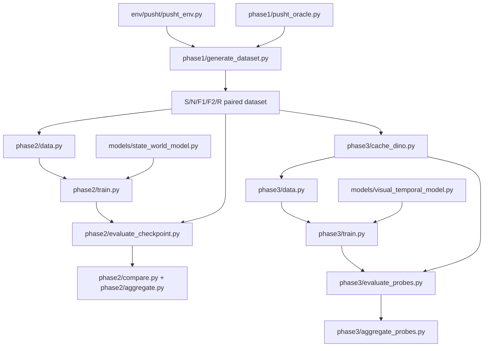

# DINO-WM Recovery 项目实现索引

本文件只说明代码边界和目录职责。实验设置、指标、图表和最终结论统一见 `Experiment_Report.md`；逐次作业和失败历史见 `Progress.md`。

## 1. 当前状态

```text
Phase 0  PushT runtime / snapshot / action semantics             complete
Phase 1  paired S/N/F1/F2/R simulator dataset                    complete, Gate A pass
Phase 2  oracle-state dynamics / ranking / closed-loop           complete, Gate B pass
Phase 3  frozen-DINO temporal representation probes              complete, Gate C fail
```

Experiment A 支持 recovery-specific state-dynamics feasibility；Experiment B 尚不支持 recovery-specific visual-representation claim。

## 2. 原始框架与新增代码的边界

### 原始 DINO-WM 主体

| 目录或文件 | 职责 |
|---|---|
| `train.py` | 原始 Hydra 视觉世界模型训练入口 |
| `plan.py` | 原始视觉 planning 入口 |
| `models/dino.py` | frozen DINO encoder |
| `models/visual_world_model.py` | 原始 visual world model |
| `models/vit.py` | causal ViT predictor；recovery models 复用该 family |
| `models/proprio.py`、`models/decoder/`、`models/encoder/` | 原始模型组件 |
| `datasets/` | 原始任务数据加载器；仅对 PushT normalization 做过必要严谨性修正 |
| `planning/` | 原始 CEM/GD/MPC；增加了 action-bound safety fixes |
| `conf/` | 原始 Hydra 配置体系 |
| `env/` | 原始环境；PushT runtime 为 recovery paired experiment 做过必要扩展 |

### Recovery 项目新增主体

| 目录 | 职责 |
|---|---|
| `phase0/` | PushT runtime 与 deterministic replay 可视化 |
| `phase1/` | paired dataset、oracle、生成和数据可视化 |
| `phase2/` | oracle-state world model 的训练、评价、比较、统计和图表 |
| `phase3/` | frozen-DINO cache、temporal model 训练、probe、统计和图表 |
| `models/state_world_model.py` | Experiment A 的 11-D state/action dynamics model |
| `models/visual_temporal_model.py` | Experiment B 的 trainable temporal adapter |
| `scripts/slurm_*.sh` | 远端 batch entrypoints，不包含研究逻辑 |
| `tests/test_pusht_phase*.py` | recovery pipeline regression tests |
| `report_assets/` | `Experiment_Report.md` 直接嵌入的轻量 PNG |
| `experiment_outputs/` | Git 中保留的轻量聚合 JSON；完整数据/checkpoint 不进入 Git |

## 3. 数据与模型调用关系



## 4. 分阶段文件说明

### Phase 0

| 文件 | 职责 |
|---|---|
| `phase0/visualize.py` | PushT RGB、snapshot restoration 和 deterministic replay smoke visualization |
| `env/pusht/action_utils.py` | relative command bounds、clipping 和 simulator scaling 的单一来源 |
| `tests/test_pusht_phase0.py` | action、task metrics、normalization 和 replay tests |

### Phase 1

| 文件 | 职责 |
|---|---|
| `phase1/pusht_oracle.py` | 受控 translation 的 nominal/recovery oracle |
| `phase1/pusht_dataset.py` | trajectory record、snapshot、分支生成、split、audit、variant index |
| `phase1/generate_dataset.py` | 数据生成 CLI |
| `phase1/visualize_dataset.py` | 最大差异代表选择、S-to-R storyboard、N/R montage 和 trajectory overlay |
| `phase1/README.md` | schema 与使用说明 |
| `scripts/slurm_generate_pusht_phase1.sh` | Phase 1 SLURM wrapper |
| `tests/test_pusht_phase1.py` | paired-state、alignment、labels、split 和 audit tests |

五个分支：

- `S`：完整 nominal success。
- `N`：扰动前 snapshot 的等 horizon nominal success control。
- `F1`：扰动后继续旧 open-loop plan。
- `F2`：相同扰动后 snapshot 的 zero-action neutral failure。
- `R`：相同扰动后 snapshot 的 replanning recovery。

### Phase 2 / Experiment A

| 文件 | 职责 |
|---|---|
| `phase2/data.py` | scenario-safe windows、shared normalization、branch-balanced sampling |
| `phase2/train.py` | StateWorldModel 训练与 checkpoint |
| `phase2/evaluation.py` | multi-horizon prediction、counterfactual ranking、bounded CEM、closed-loop metrics |
| `phase2/evaluate_checkpoint.py` | checkpoint evaluation CLI |
| `phase2/compare.py` | 单 seed、成对 scenario comparison |
| `phase2/aggregate.py` | seed × scenario crossed bootstrap aggregation |
| `phase2/plot_report.py` | pilot report figures |
| `phase2/plot_confirmatory.py` | locked-P3 fresh-confirmation figure |
| `scripts/slurm_train_state_wm.sh` | train + default evaluation wrapper |
| `scripts/slurm_eval_state_wm*.sh` | offline/closed-loop evaluation wrappers |

Experiment A 输入 11-D oracle state，不调用 DINO；因此其结论不能写成视觉 representation 改进。

### Phase 3 / Experiment B

| 文件 | 职责 |
|---|---|
| `phase3/cache_dino.py` | 从完整 sim state 确定性重渲染并缓存 frozen DINOv2 patch tokens |
| `phase3/data.py` | cache schema、visual windows、probe labels、train-only proprio stats |
| `phase3/train.py` | temporal adapter 训练与 checkpoint |
| `phase3/evaluate_probes.py` | raw/random/SFN/SFR/oracle frozen probes |
| `phase3/aggregate_probes.py` | 三 seed 配对误差和 crossed bootstrap |
| `phase3/plot_results.py` | Experiment B summary figure |
| `scripts/slurm_cache_pusht_dino.sh` | cache wrapper |
| `scripts/slurm_train_visual_wm.sh` | visual temporal training wrapper |
| `scripts/slurm_eval_visual_probe*.sh` | probe wrapper/suite |

visual model 输入仅为 frozen DINO tokens、proprioception 和 action history；oracle state 只用于标签和独立 reference probe。

## 5. 对原始文件的必要修改

| 文件 | 修改 | 原因 |
|---|---|---|
| `env/__init__.py`、`env/pusht/__init__.py` | 可选/延迟导入 | 纯 PushT 不应被 MuJoCo optional dependency 阻塞 |
| `env/pusht/pusht_env.py` | action semantics、完整 snapshot/restore、oracle state、coverage | 严格 counterfactual branching |
| `env/pusht/pusht_wrapper.py` | 几何 coverage task | 避免无关 agent final pose 污染成功定义 |
| `datasets/pusht_dset.py` | train-only valid-frame normalization | 去除 padding 与 split leakage |
| `models/vit.py` | causal mask 注册为 buffer | 支持可靠 device/checkpoint movement |
| `preprocessor.py` | action bounds | 统一 dataset/model/planner action convention |
| `planning/cem.py`、`planning/gd.py`、`planning/mpc.py` | optimizer 与执行前 clipping | 防止 planner 利用非法动作 |

## 6. 当前权威产物

### Git 内

- `Experiment_Report.md`：唯一最终实验报告。
- `Progress.md`：历史运行、作业、失败和决策记录。
- `AGENTS.md`：当前工作规则、研究边界和下一轮 Experiment B 计划。
- `report_assets/*.png`：报告图表。
- `experiment_outputs/phase3/aggregate_probes_3seed.json`：Experiment B 轻量聚合结果。

### 远端数据盘

```text
$DATASET_DIR/pusht_recovery_phase1_pilot_v2
$DATASET_DIR/pusht_recovery_confirmatory_v2_seed20260916_60
$DATASET_DIR/pusht_recovery_dino_cache_v2_4x4_b9585d1
$DATASET_DIR/pusht_recovery_dino_cache_confirmatory_seed20260916_60_4x4_b9585d1
$DATASET_DIR/phase2_runs/attribution_v2_65b750f
$DATASET_DIR/phase3_runs/visual_attribution_v1_3f00f1f
```

完整数据、checkpoints、逐场景 JSON 和视频只保存在远端。Git 中的 fixture 和 PNG 不能替代权威数据。

## 7. 常用入口

所有项目执行均在远端初始化环境后进行：

```bash
source ~/miniforge3/etc/profile.d/conda.sh
cd ~/dino_wm
source bash.sh
```

轻量 CLI 示例：

```bash
python -m phase1.generate_dataset --help
python -m phase1.visualize_dataset --help
python -m phase2.train --help
python -m phase2.evaluate_checkpoint --help
python -m phase3.cache_dino --help
python -m phase3.train --help
python -m phase3.evaluate_probes --help
```

正式生成、训练和批量评价继续使用 `scripts/slurm_*.sh`，并按 `AGENTS.md` 记录 job ID、commit、数据版本和结果。
